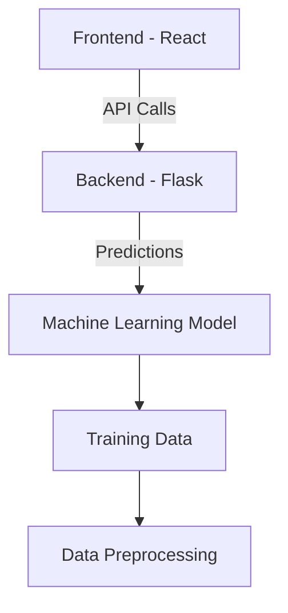

# Predictive Healthcare Analytics System


A machine learning system for predicting patient readmission risks and healthcare outcomes.

## Features

- **Machine Learning Model**: Predicts patient readmission risks using clinical data
- **REST API Backend**: Flask-based API for model serving
- **React Frontend**: Interactive dashboard for visualization
- **Data Pipeline**: Tools for data preprocessing and feature engineering

## System Architecture



## Installation

### Backend Setup
```bash
cd backend
python -m venv venv
source venv/bin/activate
pip install -r requirements.txt
```

### Frontend Setup
```bash
cd frontend
npm install
```

## Usage

1. Start backend server:
```bash
cd backend
flask run --port=5000
```

2. Start frontend development server:
```bash
cd frontend
npm start
```

3. Access the application at: `http://localhost:3000`

## Project Structure

```
Predictive-Health-Care-analysis/
├── backend/               # Flask API and model serving
│   ├── app.py            # Main application
│   ├── requirements.txt  # Python dependencies
├── frontend/             # React dashboard
│   ├── public/           # Static assets
│   ├── src/              # React components
├── model.py              # ML model training code
├── data_generator.py     # Data preprocessing
└── README.md             # Project documentation
```

## License

This project is licensed under the MIT License - see the [LICENSE](LICENSE) file for details.
